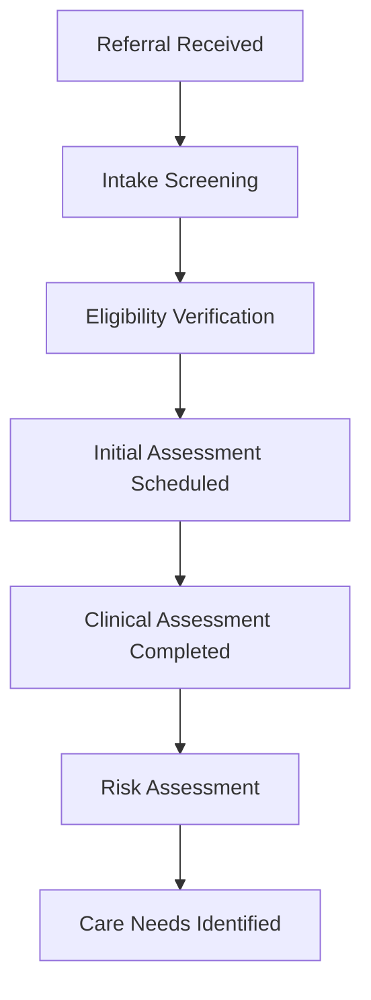
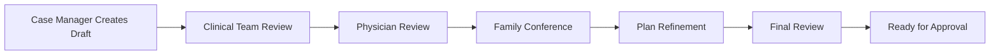
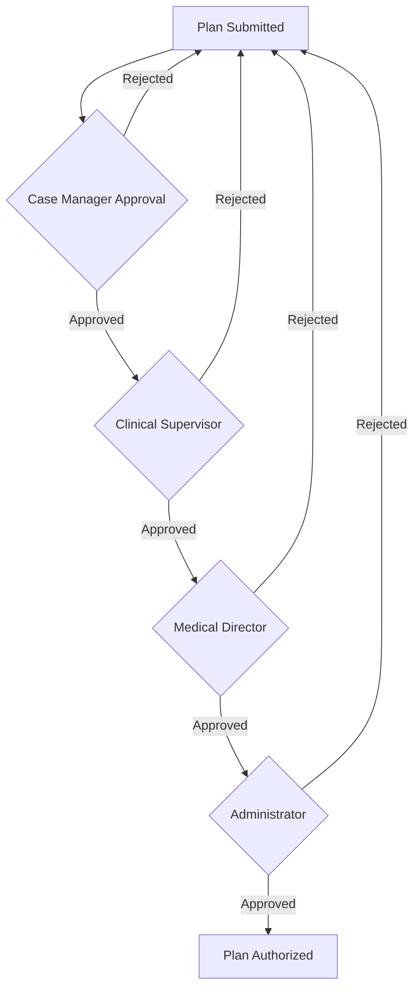

# DocuHero Service Plan Workflow

## Overview

The Service Plan Workflow is a comprehensive system designed to streamline the creation, management, and compliance verification of healthcare service plans. This workflow supports multiple care settings including home health, assisted living, skilled nursing, and independent living facilities.

## Workflow Architecture

### Core Components

1. **Plan Intake & Assessment**
2. **Template Selection & Customization**
3. **Collaborative Editing & Review**
4. **Compliance Verification**
5. **Approval & Authorization**
6. **Implementation & Tracking**
7. **Review & Updates**
8. **Reporting & Analytics**

## Detailed Workflow Stages

### Stage 1: Plan Intake & Assessment (Days 1-2)

#### Initial Assessment


#### Key Activities
- **Referral Processing**: Receive and validate referral information
- **Insurance Verification**: Confirm coverage and benefits
- **Initial Screening**: Assess basic eligibility and needs
- **Assessment Scheduling**: Coordinate with clinical staff and family
- **Comprehensive Assessment**: Complete standardized assessment tools
- **Risk Stratification**: Identify high-risk factors and safety concerns

#### Required Documentation
- Referral forms and physician orders
- Insurance authorization documents
- Assessment forms (OASIS, MDS, or state-specific)
- Medical history and medication lists
- Emergency contact information
- Advance directives and care preferences

#### Stakeholders Involved
- **Intake Coordinator**: Manages initial processing
- **Clinical Assessor**: Conducts comprehensive assessment
- **Case Manager**: Coordinates care planning
- **Family/Caregiver**: Provides input and consent
- **Physician**: Reviews and approves assessment

### Stage 2: Template Selection & Customization (Days 3-4)

#### Template Library
```typescript
interface ServicePlanTemplate {
  id: string;
  name: string;
  category: 'home-health' | 'assisted-living' | 'skilled-nursing' | 'independent-living';
  state: string[];
  sections: TemplateSections[];
  requiredFields: string[];
  complianceRules: ComplianceRule[];
  estimatedCompletionTime: number;
}
```

#### Available Templates

**Home Health Templates**
- Skilled Nursing Care Plan
- Physical Therapy Plan
- Occupational Therapy Plan
- Speech Therapy Plan
- Medical Social Work Plan
- Home Health Aide Plan

**Assisted Living Templates**
- Personal Care Plan
- Medication Management Plan
- Social Engagement Plan
- Nutrition Plan
- Mobility & Safety Plan

**Skilled Nursing Templates**
- Comprehensive Care Plan
- Rehabilitation Plan
- Discharge Planning
- Quality Assurance Plan
- Infection Control Plan

#### Customization Process
1. **Template Selection**: Choose appropriate template based on:
   - Care setting and services needed
   - State regulations and requirements
   - Payer source and coverage
   - Client complexity and risk level

2. **Section Configuration**: Enable/disable sections based on:
   - Assessed needs and goals
   - Regulatory requirements
   - Organizational policies
   - Quality measures

3. **Field Customization**: Modify fields for:
   - Client-specific information
   - Cultural preferences
   - Language requirements
   - Special accommodations

### Stage 3: Collaborative Editing & Review (Days 5-8)

#### Multi-Disciplinary Team Process


#### Team Roles & Responsibilities

**Case Manager/Care Coordinator**
- Creates initial draft plan
- Coordinates team input
- Ensures completeness and accuracy
- Manages timeline and milestones

**Clinical Team**
- Provides discipline-specific input
- Reviews goals and interventions
- Validates clinical appropriateness
- Identifies potential conflicts

**Physician/Medical Director**
- Reviews medical orders
- Validates diagnoses and prognosis
- Approves medication management
- Signs off on medical necessity

**Client/Family**
- Provides preferences and priorities
- Reviews and approves goals
- Understands roles and responsibilities
- Signs consent and agreements

#### Collaborative Features
- **Real-time Editing**: Multiple users can edit simultaneously
- **Comment System**: Team members can add notes and suggestions
- **Version Control**: Track changes and maintain edit history
- **Notification System**: Alert team members of updates and deadlines
- **Video Conferencing**: Integrated calls for team meetings
- **Document Sharing**: Secure sharing of supporting documents

### Stage 4: Compliance Verification (Days 7-9)

#### Automated Compliance Checking
```javascript
const complianceCheck = {
  hipaCompliance: true,
  stateRegulations: 'GA-compliant',
  payerRequirements: 'Medicare-approved',
  qualityMeasures: 'CMS-aligned',
  safetyStandards: 'Joint Commission compliant',
  overallScore: 96.7
};
```

#### Compliance Categories

**Regulatory Compliance**
- HIPAA privacy and security requirements
- State licensing and certification standards
- CMS conditions of participation
- Joint Commission standards
- OSHA safety requirements

**Payer Compliance**
- Medicare coverage criteria
- Medicaid state plan requirements
- Insurance prior authorization
- Medical necessity documentation
- Billing and coding accuracy

**Quality Standards**
- Evidence-based practice guidelines
- Clinical quality measures
- Patient safety indicators
- Outcome measurement tools
- Performance benchmarks

#### Verification Process
1. **Automated Scanning**: AI scans plan for compliance issues
2. **Rule Matching**: Compare against regulatory databases
3. **Risk Assessment**: Identify high-risk non-compliance areas
4. **Recommendation Engine**: Suggest corrections and improvements
5. **Compliance Scoring**: Generate overall compliance rating
6. **Audit Trail**: Document all compliance checks and results

### Stage 5: Approval & Authorization (Days 10-12)

#### Approval Workflow


#### Approval Levels

**Level 1: Case Manager**
- Reviews completeness and accuracy
- Validates assessment alignment
- Checks internal consistency
- Verifies team input incorporation

**Level 2: Clinical Supervisor**
- Reviews clinical appropriateness
- Validates evidence-based practices
- Ensures scope of practice compliance
- Checks resource availability

**Level 3: Medical Director**
- Reviews medical orders and diagnoses
- Validates medical necessity
- Approves medication management
- Signs physician orders

**Level 4: Administrator**
- Final compliance review
- Budget and resource approval
- Risk management assessment
- Quality assurance sign-off

#### Electronic Signatures
- **Digital Signing**: Secure electronic signature process
- **Audit Trail**: Complete record of who signed when
- **Authentication**: Multi-factor authentication required
- **Legal Validity**: Compliant with state e-signature laws
- **Document Security**: Tamper-proof signed documents

### Stage 6: Implementation & Tracking (Days 13+)

#### Implementation Planning
```typescript
interface ImplementationPlan {
  startDate: Date;
  serviceSchedule: ServiceSchedule[];
  staffAssignments: StaffAssignment[];
  equipmentNeeds: Equipment[];
  milestones: Milestone[];
  communicationPlan: Communication[];
}
```

#### Service Delivery Components

**Staff Coordination**
- Schedule creation and management
- Staff assignment and backup coverage
- Skills matching and competency verification
- Communication protocols
- Emergency procedures

**Resource Management**
- Equipment ordering and delivery
- Supply management and replenishment
- Technology setup and training
- Space and facility requirements
- Transportation coordination

**Progress Monitoring**
- Visit documentation requirements
- Progress note templates
- Outcome measurement tools
- Communication logs
- Incident reporting procedures

#### Real-Time Tracking
- **Service Delivery**: Track completed vs. scheduled services
- **Goal Progress**: Monitor progress toward plan goals
- **Quality Indicators**: Track quality metrics and outcomes
- **Satisfaction Scores**: Monitor client and family satisfaction
- **Compliance Metrics**: Ongoing compliance monitoring

### Stage 7: Review & Updates (Ongoing)

#### Review Schedule
```javascript
const reviewSchedule = {
  initialReview: '30 days',
  routineReviews: '90 days',
  asNeededReviews: 'any time',
  annualReview: '365 days',
  dischargePlanning: '30 days before expected discharge'
};
```

#### Review Triggers

**Scheduled Reviews**
- 30-day initial review
- 90-day routine reviews
- Annual comprehensive review
- Payer-required reviews

**Event-Triggered Reviews**
- Significant change in condition
- Hospitalization or emergency room visit
- Change in care needs or goals
- Family or client request
- Provider concerns or recommendations

**System-Triggered Reviews**
- Compliance score drops below threshold
- Quality indicators show decline
- Safety incidents or near misses
- Regulatory requirement changes

#### Update Process
1. **Change Assessment**: Evaluate need for plan modifications
2. **Impact Analysis**: Assess effects on services, goals, and compliance
3. **Stakeholder Input**: Gather input from team, client, and family
4. **Revision Planning**: Plan specific changes and timeline
5. **Approval Process**: Route through appropriate approval levels
6. **Implementation**: Update services and notify all parties
7. **Documentation**: Record all changes and rationale

### Stage 8: Reporting & Analytics (Continuous)

#### Standard Reports

**Plan Status Reports**
- Plans in each workflow stage
- Average completion times
- Approval bottlenecks
- Compliance scores by plan type

**Quality Reports**
- Goal achievement rates
- Client satisfaction scores
- Clinical outcome measures
- Safety incident tracking

**Compliance Reports**
- Regulatory compliance trends
- Audit findings and corrections
- State survey performance
- Payer approval rates

**Operational Reports**
- Staff productivity metrics
- Resource utilization rates
- Cost per plan analysis
- Timeline performance

#### Advanced Analytics

**Predictive Analytics**
- Risk stratification models
- Readmission prediction
- Discharge planning optimization
- Resource demand forecasting

**Benchmarking**
- Industry performance comparisons
- Best practice identification
- Cost effectiveness analysis
- Quality measure trending

**Custom Dashboards**
- Role-based reporting
- Real-time performance monitoring
- Exception reporting
- Executive summaries

## Technology Integration

### Core Platform Features
- **Workflow Engine**: Configurable workflow management
- **Template System**: Dynamic template creation and management
- **Collaboration Tools**: Real-time editing and communication
- **Compliance Engine**: Automated compliance checking
- **Approval System**: Electronic signature and approval routing
- **Tracking Dashboard**: Real-time progress monitoring
- **Reporting Suite**: Comprehensive analytics and reporting

### Integration Points
- **EHR Systems**: Bidirectional data exchange
- **Billing Systems**: Automated billing information transfer
- **Quality Systems**: Quality measure data integration
- **State Reporting**: Automated regulatory reporting
- **Communication Systems**: Email, SMS, and portal notifications

## Performance Metrics

### Efficiency Metrics
- **Plan Creation Time**: Average 7.2 days (vs. 14-day industry average)
- **Approval Cycle Time**: Average 2.8 days (vs. 5-day industry average)
- **Revision Rate**: <15% of plans require major revisions
- **Staff Productivity**: 40% reduction in administrative time

### Quality Metrics
- **Compliance Score**: Average 95.7% compliance rating
- **Goal Achievement**: 87% of client goals met or exceeded
- **Client Satisfaction**: 4.6/5.0 average rating
- **Clinical Outcomes**: 23% improvement in key metrics

### Financial Metrics
- **Cost Per Plan**: 35% reduction in plan creation costs
- **Revenue Optimization**: 12% increase in reimbursement
- **Operational Efficiency**: 28% reduction in rework costs
- **ROI**: 340% return on investment within 18 months

This Service Plan Workflow provides a comprehensive, efficient, and compliant approach to healthcare service planning that improves outcomes while reducing administrative burden and ensuring regulatory compliance.